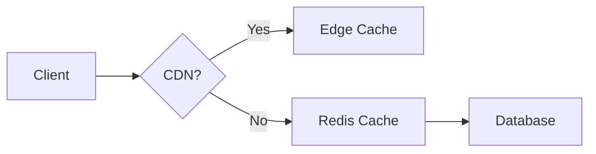

# System Design Interview Cheat Sheet

## 🔥 Top 10 Interview Questions

1. **Design Twitter**
   - Handle 500M tweets/day
   - Fan-out: Push vs Pull
   - Trending hashtags

2. **Design URL Shortener**
   ```python
   def shorten(url):
       hash = md5(url)[:6]
       return f"https://shr.ink/{hash}"
   ```
   - 301 vs 302 redirect
   - Analytics tracking

3. **Design Chat System**
   - Websockets vs Polling
   - Read receipts
   - E2E encryption

4. **Design Rate Limiter**
   - Token bucket algorithm
   - Redis + Lua scripts
   - Distributed counters

5. **Design Payment System**
   - Idempotency keys
   - Saga pattern
   - Fraud detection

## 💡 Quick Answer Guide

### Scaling Databases
| Technique       | When to Use                 | Example           |
|----------------|----------------------------|------------------|
| Read Replicas  | Read-heavy workloads       | User profiles    |
| Sharding       | Write scalability         | Tweets by userID |
| Denormalization| Reduce joins              | Embedded comments|

### Cache Strategies


## 🚨 Anti-Patterns to Avoid
- "We'll just use blockchain"
- Not estimating scale
- Ignoring network latency
- Single point of failure

## 📈 Estimation Formulas
- **QPS**: (Daily users × requests/user) ÷ 86400
- **Storage**: (Record size × records/day) × retention_days
- **Cache Size**: 20% of hot data

## 💬 Behavioral Questions
1. "How would you improve our current architecture?"
   - Focus on metrics first
2. "Describe a challenging system you built"
   - Use STAR method
3. "How do you make tech decisions?"
   - Pros/cons, benchmarks, pilot tests

## 🛠️ Whiteboard Tips
1. Start with requirements
2. Draw data flow (client → LB → services → DB)
3. Annotate with technologies
4. Highlight scaling points
